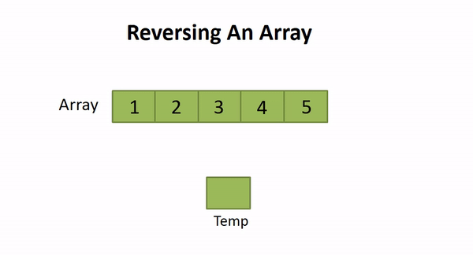

# Data Structure

## Array

> C++

Implement a dynamic array.

- Initalize with dynamic memory allocation
- Insert value with index
- Remove (or set to zero) value with index
- Reverse the array

> Python

In Python, the list is a dynamic array.

## Vector

> C++

A vector is a dynamic array in C++.

- `push_back()`
- `pop_back()`
- `insert()`: insert a value with index
- `erase()`: remove a value with index
- `clear()`: remove all values
- `sort()`: sort the vector
- `reverse()`: reverse the vector

[Some differences between vector and array](https://stackoverflow.com/questions/15079057/arrays-vs-vectors-introductory-similarities-and-differences)

> Python

In Python, vector can be implemented by list.

- `append()`
- `pop()`: remove the value with index, default is the last one `pop(-1)`
- `insert()`: insert a value with index
- `del`: remove the value with index, `del list[index]`, or remove list `del list`
- `remove()`: remove the value with value, `list.remove(value)`, same value will only remove the first one
- `sort()`
- `reverse()`